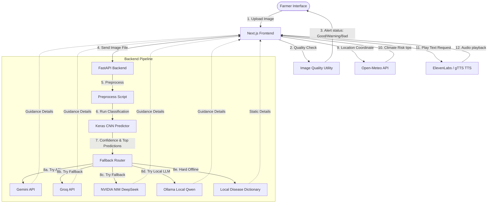

# RootSage AI - System Architecture & Tech Stack Documentation

RootSage AI is a premium, AI-powered farmer assistance platform for plant disease detection. It leverages computer vision (CNN models) and Large Language Models (LLMs) to help farmers diagnose crop and medicinal plant diseases from images, and provides actionable recommendations in multiple languages (English, Hindi, Telugu).

This document serves as a complete architectural blueprint, tech stack guide, and operational runbook for understanding, developing, and deploying RootSage AI.

---

## 🗺️ Codebase Directory Structure

Below is the directory tree of the project with a high-level explanation of each component:

```text
ai-plant-disease/
├── .vscode/                     # Editor-specific configurations
├── backend/                     # FastAPI backend application
│   ├── api/
│   │   └── config.py            # Pydantic Settings configuration manager
│   ├── inference/
│   │   ├── predictor.py         # Keras CNN model loader & prediction runner
│   │   └── preprocess.py        # Image transformations per model family
│   ├── models/
│   │   └── schemas.py           # Pydantic schemas for request/response validation
│   ├── routes/
│   │   ├── guidance.py          # Endpoint: POST /generate-guidance (LLM guidance)
│   │   ├── health.py            # Endpoints: GET /health, GET /model-info
│   │   ├── predict.py           # Endpoint: POST /predict (runs image inference)
│   │   ├── progress.py          # Endpoint: POST /progress-report (compares scans)
│   │   ├── voice.py             # Endpoint: POST /voice (TTS generation)
│   │   └── whatsapp.py          # Endpoint: POST /send-whatsapp (shares report)
│   ├── services/
│   │   ├── gemini_service.py    # Gemini API client & provider fallback router
│   │   ├── groq_service.py      # Groq Llama-3.1 API client
│   │   ├── nvidia_service.py    # NVIDIA NIM DeepSeek API client
│   │   ├── ollama_service.py    # Local Ollama client (Qwen2.5-Coder)
│   │   ├── local_disease_dictionary.py  # Zero-network offline fallback dictionaries
│   │   ├── progress_service.py  # LLM-based progress report analyzer
│   │   ├── voice_service.py     # ElevenLabs & gTTS audio generators
│   │   └── whatsapp_service.py  # Twilio WhatsApp SMS & wa.me link builders
│   ├── Dockerfile               # Backend Docker container config
│   ├── Procfile                 # Heroku/Render process commands
│   ├── requirements.txt         # Python dependencies
│   └── main.py                  # Application entrypoint & CORS middleware configuration
├── frontend/                    # Next.js frontend application
│   ├── components/
│   │   ├── Header.tsx / Footer.tsx  # Layout headers & footers
│   │   ├── Hero.tsx                 # Dynamic, modern landing banner
│   │   ├── ImageUploader.tsx        # Drag & drop photo zone & camera capture
│   │   ├── InfoSections.tsx         # Tabbed/structured AI guidance viewer
│   │   ├── LanguageSelector.tsx     # Language toggle dropdown
│   │   ├── ResultsPanel.tsx         # Main scan results dashboard
│   │   └── WeatherRiskCard.tsx      # Open-Meteo risk analysis panel
│   ├── data/
│   │   └── diseaseLibrary.ts        # Index of supported crop classes
│   ├── hooks/                       # Custom React hooks
│   ├── i18n/
│   │   └── translations.ts          # English, Hindi, and Telugu static text
│   ├── pages/
│   │   ├── disease/
│   │   │   └── [name].tsx           # Dynamic leaf disease info details page
│   │   ├── _app.tsx                 # Next.js global App component wrapper
│   │   ├── admin.tsx                # Admin diagnostics panel for API logs
│   │   ├── history.tsx              # Local scan history list page
│   │   ├── index.tsx                # Main diagnosis workspace
│   │   ├── library.tsx              # Disease knowledge bank index
│   │   └── progress.tsx             # Scan progress tracker and comparison tool
│   ├── services/
│   │   ├── api.ts                   # Frontend Axios client & API endpoints
│   │   └── weather.ts               # Open-Meteo client-side weather fetcher
│   ├── styles/                      # CSS styles
│   ├── utils/
│   │   ├── adminDiagnostics.ts      # LocalStorage logger for frontend errors
│   │   ├── disease.ts               # Helper utilities for string formats
│   │   ├── format.ts                # Date/text formatters
│   │   ├── imageQuality.ts          # Canvas-based client-side image checkers
│   │   ├── progressAnalysis.ts      # Client-side heuristic scanner comparison
│   │   ├── severity.ts              # Heuristic crop severity calculation
│   │   └── storage.ts               # LocalStorage wrappers for history & settings
│   ├── Dockerfile                   # Frontend Docker container config
│   ├── tailwind.config.ts           # CSS styling tokens & colors
│   ├── tsconfig.json                # TypeScript configurations
│   └── package.json                 # Node.js configurations & dependencies
├── models/                      # Local TensorFlow/Keras CNN model binaries
│   ├── class_names.json         # Crop model output class labels (36 classes)
│   ├── EfficientNetB0.h5        # High-accuracy crop disease model
│   ├── MobileNetV2.h5           # Lightweight crop disease model alternative
│   ├── DenseNet121.h5           # Alternative crop model
│   ├── ResNet50 (1).h5          # Heavy alternative crop model
│   ├── VGG16.h5                 # Alternative crop model
│   ├── medicinal_disease_recognition_model.h5          # Medicinal plant model
│   └── medicinal_disease_recognition_model_classes.json # Medicinal model classes (13 classes)
├── notebooks/                   # Jupyter notebooks for model training
│   ├── RootSage_Combined_Plant_Disease_Training.ipynb  # General crop model training
│   └── RootSage_Medicinal_Plant_Training.ipynb         # Medicinal model training
├── getstructure.py              # Directory tree visualizer script
├── README.md                    # Core developer readme
├── DEPLOYMENT.md                # Deployment guidelines (local + cloud)
└── COLLEGE_SERVER_DEPLOYMENT.md  # Production server setup instructions
```

---

## 🛠️ Technology Stack

RootSage AI split-architecture is built on the following technologies:

| Layer | Technology | Purpose |
| :--- | :--- | :--- |
| **Frontend UI** | [Next.js](https://nextjs.org/) + React | Server-side rendering (SSR) framework, responsive structure, and routing. |
| **Styling** | [Tailwind CSS](https://tailwindcss.com/) + Framer Motion | Modern styling palette and smooth animations. |
| **Backend API** | [FastAPI](https://fastapi.tiangolo.com/) + Uvicorn | High-performance Python ASGI web framework for endpoints. |
| **Machine Learning** | [TensorFlow / Keras](https://www.tensorflow.org/) | Pre-trained CNN model loading and fast image classification. |
| **Image Handling** | [Pillow (PIL)](https://python-pillow.org/) | Core image format verification, rotation normalization, and scaling. |
| **Language Models** | Gemini, Groq, NVIDIA Build, Ollama | Multi-provider fallback chain generating contextual farmer advice. |
| **Weather Risk** | [Open-Meteo API](https://open-meteo.com/) | Live weather metrics for regional crop disease risk assessment. |
| **Voice Synthesis** | ElevenLabs + gTTS fallback | Base64 audio generation for hands-free farmer reading. |
| **Sharing** | Twilio API + `wa.me` redirect | Push report summaries straight to WhatsApp. |
| **Data Persistence** | HTML5 LocalStorage | Zero-db local scan records, progress checks, and follow-up reminders. |

---

## 📐 System Architecture & Workflow

RootSage AI integrates visual computer vision models, LLMs, and client-side web services into a unified diagnosis pipeline.

### Component Interaction



---

## ⚙️ Detailed Core Systems

### 1. Client-Side Image Quality Heuristics
Before uploading the image to the server, the frontend performs canvas-based visual pre-checks in `imageQuality.ts`:
- **Brightness Analysis**: Converts all pixels to Grayscale values using the formula:
  $$\text{Gray} = 0.299 \times R + 0.587 \times G + 0.114 \times B$$
  Average brightness is computed across the array. Values below 55 generate low-light warnings; values above 220 indicate extreme reflections/glare.
- **Edge Sharpness (Laplacian Approximation)**: Calculates the difference between adjacent pixel values (horizontal/vertical gradients) to identify blurry images:
  $$G_x = Gray(x+1, y) - Gray(x-1, y)$$
  $$G_y = Gray(x, y+1) - Gray(x, y-1)$$
  $$\text{Edge Value} = \sqrt{G_x^2 + G_y^2}$$
  Average sharpness score below 5 triggers a blocker (Bad photo), forcing the user to take a steadier shot.

### 2. Deep Learning Classification Engine
The backend (`inference/predictor.py`) runs predictions using two customized model configurations:
1. **Normal Crops Mode (`crop`)**: 36 classes (Apples, Potato, Blueberries, Corn, Grapes, Peach, Peppers, Tomatoes, Squash, Strawberries, and Cherry, including a background non-leaf detection class). Powered by `models/EfficientNetB0.h5`.
2. **Medicinal Crops Mode (`medicinal`)**: 13 classes. Powered by `models/medicinal_disease_recognition_model.h5`.

- **Preprocessing** (`inference/preprocess.py`): Normalizes EXIF orientations (using `ImageOps.exif_transpose`), resizes images to $224 \times 224$ pixels, converts to a NumPy float32 batch array, and applies model-specific functions (e.g., scaling between $[-1, 1]$ or raw standard values).
- **Certainty Controls**: Predicts top-3 options. If the primary prediction score is $< 40\%$, the system flags it as "Low Confidence" and appends a warning that the leaf type or disease may be outside the trained dataset.

### 3. Dynamic LLM Guidance System
If a leaf disease is identified, the backend requests farmer-friendly instructions (explanation, symptoms, prevention, treatment, advice) using a robust provider fallback sequence (`gemini_service.py`):

1. **Gemini API** (`gemini-2.0-flash`): Primary provider returning fast, formatted structured JSON.
2. **Groq Cloud API** (`llama-3.1-8b-instant`): Second fallback provider if Gemini quota is exceeded or offline.
3. **NVIDIA DeepSeek** (`deepseek-ai/deepseek-v4-flash`): Third fallback.
4. **Ollama Local Engine** (`qwen2.5-coder:7b`): Fourth fallback, running entirely offline.
5. **Static Local Dictionary** (`local_disease_dictionary.py`): Ultimate safety net containing pre-defined guidelines for generic classes, healthy leaves, and non-leaf backgrounds.

### 4. Disease Progress Comparison Engine
The system lets farmers track disease progress over time by comparing scans taken at different dates. 
- **Client Heuristics** (`utils/progressAnalysis.ts`): Rejects comparisons if crops do not match or if the images have low model confidence. If the crop matches:
  - Disease → Healthy class: Status = **Improving**.
  - Healthy → Disease class: Status = **Worsening**.
  - Same Disease label: Status = **Stable** (safety warning: confidence score changes represent model certainty, NOT severity).
- **Backend LLM Assessment** (`services/progress_service.py`): Passes the heuristic comparison data into the LLM chain to generate contextual text summaries and next-step actions in the target language.

### 5. Local Weather Risk Checker
Utilizes geolocation in `components/WeatherRiskCard.tsx` and sends coordinates to the Open-Meteo forecast API:
- **Humidity $\ge 80\%$**: Increases risk score (fungal spore propagation).
- **Rain $> 0\text{ mm}$**: Increments risk score and warns against spraying pesticide.
- **Wind Speed $\ge 18\text{ km/h}$**: Warns against spraying to prevent drift.

### 6. Multi-lingual Voice System
Synthesizes speech instructions in English, Hindi, or Telugu (`services/voice_service.py`):
- Uses **ElevenLabs API** (`eleven_multilingual_v2`) for natural, human-like voice synthesis.
- Falls back instantly to **gTTS (Google Text-to-Speech)** if the ElevenLabs API key is missing or fails.

### 7. Results Sharing
- **Twilio SMS Gateway**: Transmits diagnosis details directly via Twilio WhatsApp sandbox sender (`services/whatsapp_service.py`).
- **Direct Redirection Links**: Generates `wa.me/?text=...` URI redirections, letting farmers open WhatsApp directly on their phones or web browsers to send the card details.

---

## 📊 Supported Disease Classes Matrix

The normal crop classifier supports the following classes inside `models/class_names.json`:

| Crop | Healthy Class | Supported Diseases |
| :--- | :--- | :--- |
| **Apple** | `Apple___healthy` | Apple Scab, Black Rot, Cedar Apple Rust |
| **Blueberry** | `Blueberry___healthy` | - |
| **Cherry** | `Cherry___healthy` | Powdery Mildew |
| **Corn** | `Corn___healthy` | Cercospora Gray Leaf Spot, Common Rust, Northern Leaf Blight |
| **Grape** | `Grape___healthy` | Black Rot, Esca (Black Measles), Leaf Blight (Isariopsis Spot) |
| **Orange** | - | Huanglongbing (Citrus Greening) |
| **Peach** | `Peach___healthy` | Bacterial Spot |
| **Pepper Bell**| `Pepper,_bell___healthy`| Bacterial Spot |
| **Potato** | `Potato___healthy` | Early Blight, Late Blight |
| **Raspberry** | `Raspberry___healthy` | - |
| **Soybean** | `Soybean___healthy` | - |
| **Squash** | - | Powdery Mildew |
| **Strawberry**| `Strawberry___healthy` | Leaf Scorch |
| **Tomato** | `Tomato___healthy` | Bacterial Spot, Early Blight, Late Blight, Leaf Mold, Septoria Leaf Spot, Two-Spotted Spider Mite |
| **Non-leaf** | - | Background without leaves |

---

## 🚀 Deployment Modes

### Mode A: Local Demo Setup (e.g., Presentation/Viva)
During local demonstrations, it is best to run the TensorFlow model and local Ollama server locally to avoid cloud GPU costs or uploading huge model binaries to servers.

```text
[ Vercel Frontend ]
       │ (Calls HTTPS URL)
       ▼
[ ngrok Tunnel ] 
       │ (Bypasses local NAT)
       ▼
[ Local Laptop Port 8001 ]
       │ 
       ├─► FastAPI app (main.py) 
       ├─► Local TensorFlow models (.h5)
       └─► Ollama Engine (qwen2.5-coder:7b)
```

1. **Activate local backend**:
   ```powershell
   cd backend
   python -m venv .venv
   .venv\Scripts\activate
   pip install -r requirements.txt
   python -m uvicorn main:app --host 0.0.0.0 --port 8001
   ```
2. **Start ngrok HTTPS forwarder**:
   ```powershell
   ngrok http 8001
   ```
3. **Deploy frontend to Vercel**: 
   - Set the root directory to `frontend`.
   - Add environment variable `NEXT_PUBLIC_API_BASE_URL` with your ngrok HTTPS forwarding URL.

---

### Mode B: Production Setup (e.g., Dedicated Server)
For permanent web deployment, deploy the Next.js frontend to Vercel, and configure the backend on an Ubuntu Server.

```text
[ Vercel Frontend ]
       │ (API Requests)
       ▼
[ Nginx Port 80/443 ] (Reverse Proxy, Static limits)
       │
       ▼
[ FastAPI (Systemd Service) Port 8000 ]
       │
       ├─► TensorFlow Models
       └─► Ollama Service (127.0.0.1:11434) / Cloud API Keys
```

#### 1. System Dependencies Setup
```bash
sudo apt update
sudo apt install python3.11 python3.11-venv nginx git curl -y
```

#### 2. Model Installation
Place the models directory containing the `.h5` files at `~/RootSage/models/` and ensure class files are correctly placed.

#### 3. Backend Setup
```bash
cd ~/RootSage/backend
python3.11 -m venv .venv
source .venv/bin/activate
pip install -r requirements.txt
cp server.env.example .env
nano .env # Set ENVIRONMENT=production, ADMIN_TOKEN, and your LLM API Keys
```

#### 4. Configure Systemd Service
Create the service configuration file:
```bash
sudo nano /etc/systemd/system/rootsage-backend.service
```
Paste the following structure:
```ini
[Unit]
Description=RootSage FastAPI Backend
After=network.target

[Service]
User=ubuntu
WorkingDirectory=/home/ubuntu/RootSage/backend
Environment="PATH=/home/ubuntu/RootSage/backend/.venv/bin"
ExecStart=/home/ubuntu/RootSage/backend/.venv/bin/uvicorn main:app --host 127.0.0.1 --port 8000
Restart=always

[Install]
WantedBy=multi-user.target
```
Enable and start the service:
```bash
sudo systemctl daemon-reload
sudo systemctl enable rootsage-backend
sudo systemctl start rootsage-backend
```

#### 5. Configure Nginx Reverse Proxy
Edit the default site block:
```bash
sudo nano /etc/nginx/sites-available/default
```
Replace the content configuration:
```nginx
server {
    listen 80;
    server_name your_domain_or_server_ip;

    client_max_body_size 8M; # Matches MAX_UPLOAD_MB limit

    location / {
        proxy_pass http://127.0.0.1:8000;
        proxy_set_header Host $host;
        proxy_set_header X-Real-IP $remote_addr;
        proxy_set_header X-Forwarded-For $proxy_add_x_forwarded_for;
        proxy_set_header X-Forwarded-Proto $scheme;
    }
}
```
Validate and restart Nginx:
```bash
sudo nginx -t
sudo systemctl restart nginx
```
Update your frontend environment settings (`NEXT_PUBLIC_API_BASE_URL`) on Vercel to point to your domain, then trigger a rebuild.

---

## 🔒 Crucial Architectural Constraints & Safety Rules

1. **Model Confidence Disclaimer**: 
   A model's confidence rating is purely a mathematical indicator of image patterns matching training classifications. It **must not** be displayed or interpreted as "disease severity" in any UI view or progress assessment text. Always output warnings explaining this limitation.
2. **Zero-Database Design Policy**: 
   To maintain user anonymity and simple operations, the system stores diagnostics logs, scan records, reminders, and comparative records purely inside the browser's `localStorage` namespace. Avoid setting up remote databases (SQL/NoSQL) unless explicitly requested.
3. **No-Double Processing Guidelines**: 
   The image quality verification and EXIF rotation logic are executed strictly client-side. The backend only performs model predictions without scaling, rotating, or compressing user images a second time, saving CPU cycles.
