# RootSage AI: Comparative Evaluation of Pretrained Convolutional Neural Networks for Multi-Class Plant Disease Classification and Deployment of a Farmer-Centric Web Platform

**Authors:** Aashrith , Tharun, Karan, Kishore, Ruthwik

**Mentor:** Dr. Akshay Pandey

**Affiliation:** Indian Institute of Information Technology, Design and Manufacturing (IIITDM), Jabalpur, India


**Keywords:** plant disease classification, transfer learning, convolutional neural networks, Grad-CAM, farmer assistance, deployed machine learning, agricultural AI

---

## Abstract

Plant diseases cause substantial crop losses worldwide, yet expert diagnosis does not scale to smallholder farms and frequent field monitoring. This work addresses two coupled problems: (1) which ImageNet-pretrained convolutional neural network (CNN) performs best under a controlled, reproducible transfer-learning protocol for 36-class leaf disease classification, and (2) how such a model can be embedded in a deployable system that converts predictions into actionable farmer guidance. Five architectures—MobileNetV2, ResNet50, VGG16, EfficientNetB0, and DenseNet121—were trained under identical conditions with frozen backbones, a shared classification head, and fixed hyperparameters. ResNet50 achieved the highest validation accuracy (99.04%), macro F1-score (0.9886), and Matthews Correlation Coefficient (0.9900). EfficientNetB0 ranked second (98.55% accuracy) with approximately half the training time and 5.5× fewer parameters than ResNet50, and was selected for production deployment. We further developed **RootSage AI**, a full-stack web platform (Next.js, FastAPI, TensorFlow) that provides multilingual diagnosis, large language model (LLM)–based treatment guidance with offline fallbacks, weather-risk context, scan history, a disease progress tracker, voice output, and WhatsApp sharing. Grad-CAM visualizations support interpretability. Results are reported on a validation split; a field evaluation protocol for Indian farm conditions is proposed. This study demonstrates that strong classification accuracy alone is insufficient for agricultural impact—the deployed system must remain usable, maintainable, and robust under low-connectivity and low-resource constraints.

---

## 1. Introduction

### 1.1 Motivation

Biotic stresses (fungi, bacteria, viruses) and abiotic stresses (nutrient deficiency, drought) frequently manifest as visible symptoms on plant leaves—chlorosis, necrosis, leaf spots, powdery growth, and wilting. Timely identification enables targeted treatment and reduces unnecessary pesticide use. Although trained agronomists provide reliable diagnosis, their availability is limited relative to the scale of modern agriculture and the number of smallholder farms in India.

Computer vision and deep learning offer a complementary approach: a farmer photographs an affected leaf with a smartphone, and a classifier suggests the most likely disease category, enabling triage before expert consultation. Convolutional neural networks (CNNs) pretrained on ImageNet have become the dominant approach for leaf image classification because they learn transferable low-level features (edges, textures) that generalize to natural leaf imagery without training very deep models from scratch.

However, published studies often compare architectures under inconsistent training recipes, report accuracy alone on balanced validation splits, or stop at offline accuracy without addressing deployment. Deployed agricultural machine learning systems are judged not only by classification metrics but also by whether they are **usable**, **maintainable**, and **robust** in real field settings—where connectivity is intermittent, users speak regional languages, and predictions must be translated into safe, understandable guidance.

### 1.2 Research questions

This work is guided by three questions:

1. **RQ1 (Classification):** Under a fair, frozen-backbone transfer-learning protocol, which pretrained CNN achieves the best multi-class plant disease classification performance on a 36-class augmented leaf dataset?
2. **RQ2 (Deployment tradeoff):** Given accuracy, parameter count, and training time, which single model is most suitable for server-side inference in a farmer-facing application?
3. **RQ3 (System design):** How can CNN predictions be integrated into an end-to-end platform that delivers actionable guidance, supports low-resource operation, and remains functional when external AI services fail?

### 1.3 Contributions

The main contributions of this paper are:

1. A **controlled comparative evaluation** of five widely used CNN backbones (MobileNetV2, ResNet50, VGG16, EfficientNetB0, DenseNet121) under identical head architecture, optimizer settings, data pipeline, and random seed.
2. **Comprehensive validation metrics** including weighted and macro precision/recall/F1, balanced accuracy, Matthews Correlation Coefficient (MCC), parameter counts, and wall-clock training time—appropriate for class-imbalanced agricultural datasets.
3. A **deployment tradeoff analysis** explaining the selection of EfficientNetB0 over the highest-accuracy ResNet50 model for production inference.
4. **RootSage AI**, a deployed farmer-oriented web system that extends classification with LLM-based guidance (multi-provider fallback), multilingual UI (English, Hindi, Telugu), weather risk, scan history, disease progress tracking, voice, and WhatsApp sharing.
5. **Grad-CAM explainability** tooling and qualitative failure-mode analysis to support trust and error understanding.
6. A **field evaluation protocol** for future validation on Indian farm imagery outside the PlantVillage-style training distribution.

---

## 2. Related work

### 2.1 Plant disease classification from leaf imagery

Hughes and Salathé introduced PlantVillage as an open repository to support mobile plant health diagnostics (arXiv:1511.08060, 2015). Mohanty et al. demonstrated that deep CNNs can achieve very high accuracy on PlantVillage-scale imagery under controlled acquisition, while performance degrades sharply under distribution shift (Frontiers in Plant Science, 2016). Sladojevic et al. applied CNN-based recognition to multiple plant diseases from leaf images (Computational Intelligence and Neuroscience, 2016).

Subsequent studies compared multiple architectures with transfer learning. Ferentinos evaluated deep learning models on large curated leaf datasets (Computers and Electronics in Agriculture, 2018). Too et al. compared fine-tuned VGG, ResNet, and DenseNet variants for plant disease identification (Computers and Electronics in Agriculture, 2019). These works motivate our multi-backbone benchmark under a unified training recipe rather than reporting a single architecture in isolation.

### 2.2 CNN architectures evaluated

We evaluate five ImageNet-pretrained families cited in the plant disease literature:

| Architecture | Reference | Inductive bias |
|--------------|-----------|----------------|
| VGG16 | Simonyan & Zisserman, ICLR 2015 | Deep stacks of 3×3 convolutions; high compute |
| ResNet50 | He et al., CVPR 2016 | Residual skip connections; strong transfer-learning default |
| DenseNet121 | Huang et al., CVPR 2017 | Dense feature reuse; parameter-efficient connectivity |
| MobileNetV2 | Sandler et al., CVPR 2018 | Depthwise separable convolutions; mobile/edge oriented |
| EfficientNetB0 | Tan & Le, ICML 2019 | Compound scaling of depth, width, and resolution |

### 2.3 Explainability and deployed agricultural AI

Selvaraju et al. introduced Grad-CAM for gradient-based visual localization of CNN decisions (ICCV, 2017). Grad-CAM highlights image regions associated with a class score but does not establish causal pathology—it is a diagnostic sensitivity tool.

Recent agricultural AI systems increasingly combine classification with user-facing guidance. Our work distinguishes itself by reporting both rigorous offline model comparison **and** a production-oriented system design with explicit fallback chains, privacy-preserving local storage, and field-oriented features (progress tracking, weather context) rarely present in classification-only papers.

---

## 3. Dataset and preprocessing

### 3.1 Dataset description

| Property | Value |
|----------|-------|
| Name | `Plant_leave_diseases_dataset_with_augmentation` |
| Task | Multi-class classification, C = 36 |
| Organization | PlantVillage-style folder-per-class |
| Labels | `class_names.json` (alphabetical folder order) |
| Crops | Apple, Blueberry, Cherry, Corn, Grape, Orange, Peach, Pepper, Potato, Raspberry, Soybean, Squash, Strawberry, Tomato |
| Special class | `Background_without_leaves` (rejects non-leaf inputs) |

The dataset name indicates that **offline augmentation** is already present in the stored image folders. No additional on-the-fly augmentation (rotation, flip, color jitter) was applied during Phase 1 training, ensuring that observed differences between models reflect backbone capacity rather than augmentation randomness.

### 3.2 Image preprocessing

All images were resized to **224 × 224 RGB** pixels. Resizing uses a standard square resize (aspect ratio not preserved), consistent with `tf.keras.utils.image_dataset_from_directory` defaults and production inference via Pillow.

Each backbone applies its corresponding Keras `preprocess_input` function inside the model graph:

| Backbone | Function |
|----------|----------|
| MobileNetV2 | `tf.keras.applications.mobilenet_v2.preprocess_input` |
| ResNet50 | `tf.keras.applications.resnet50.preprocess_input` |
| VGG16 | `tf.keras.applications.vgg16.preprocess_input` |
| EfficientNetB0 | `tf.keras.applications.efficientnet.preprocess_input` |
| DenseNet121 | `tf.keras.applications.densenet.preprocess_input` |

### 3.3 Train/validation split

Data were partitioned using:

```python
tf.keras.utils.image_dataset_from_directory(
    DATASET_DIR,
    validation_split=0.2,
    subset="training" | "validation",
    seed=123,
    image_size=(224, 224),
    batch_size=24,
)
```

TensorFlow assigns the validation fraction **within each class folder**, preserving an 80/20 proportion per class. This behaves like stratified splitting for folder-organized datasets and mitigates bias from class imbalance when reporting overall accuracy.

### 3.4 Medicinal plant extension dataset

A secondary dataset covering **13 classes** across four medicinal plants (Camphor, HariTaki, Neem, Sojina) was trained with EfficientNetV2B0 and deployed as an optional inference mode in RootSage AI. This extension is reported separately from the main five-model comparison.

---

## 4. Model comparison methodology

### 4.1 Problem formulation

Given a leaf image **x** (224 × 224 × 3 RGB), the classifier maps **x** to a probability vector **p** = (p₁, p₂, …, p_C) over C = 36 classes such that:

> **Constraint:**  Σ p_c = 1  for c = 1…C,  and  p_c ≥ 0

Let **y** ∈ {1, …, C} denote the ground-truth class index. The model is trained by minimizing the **sparse categorical cross-entropy** loss:

> **L_CE(x, y) = −log(p_y)**

For a mini-batch of size B, the empirical loss is:

> **L = (1/B) × Σ L_CE(x_i, y_i)**  for i = 1…B

The predicted class is **ĉ** = argmax(p_c). At inference time, RootSage AI also returns the top-3 classes ranked by descending p_c.

### 4.2 Mathematical formulation

#### 4.2.1 Convolutional feature extraction

A 2D convolution at spatial location (i, j) with kernel **K** and input feature map **I** is defined as:

> **(I ∗ K)(i, j) = Σ_m Σ_n  I(i+m, j+n) × K(m, n)**

Each pretrained backbone f_θ applies convolution, normalization, and activation layers to produce a spatial feature tensor **F** from input **x**:

> **F = f_θ(x)**

For **ResNet50**, residual blocks stabilize deep optimization via skip connections:

> **h_{l+1} = F_l(h_l) + h_l**

where h_l is the layer input and F_l is a residual mapping (He et al., 2016).

#### 4.2.2 Global average pooling and classification head

**Global Average Pooling (GAP)** reduces spatial dimensions by averaging each channel:

> **z_k = (1 / h·w) × Σ_i Σ_j  F_{i,j,k}**

The shared task head g_φ applies a fully connected layer with ReLU activation, dropout, and softmax output:

> **h₁ = ReLU(W₁·z + b₁)**  
> **h₂ = Dropout(h₁, p = 0.5)**  
> **z_logit = W₂·h₂ + b₂**  
> **p_c = exp(z_c) / Σ_j exp(z_j)**

The complete frozen-backbone model is:

> **ŷ = g_φ(f_θ(x))**

where θ denotes ImageNet-pretrained backbone parameters and φ denotes trainable head parameters.

#### 4.2.3 Transfer learning with frozen backbone

In Phase 1, all backbone parameters are **frozen** (θ fixed). Only φ is updated during training:

> **∂L/∂θ = 0**  (backbone not updated)  
> **φ ← φ − η × (∂L/∂φ)**

where η = 10⁻⁴ is the learning rate.

#### 4.2.4 Backpropagation and chain rule (trainable head)

For a fully connected layer with pre-activation **a** = **W·z + b** and loss L, backpropagation applies the chain rule:

> **∂L/∂W = (∂L/∂a) · zᵀ**  
> **∂L/∂b = ∂L/∂a**  
> **∂L/∂z = Wᵀ · (∂L/∂a)**

For softmax + cross-entropy, the gradient with respect to logits simplifies to:

> **∂L/∂z_c = p_c − 1[c = y]**

where 1[c = y] equals 1 when c is the true class and 0 otherwise. TensorFlow computes this internally via `sparse_categorical_crossentropy`.

During **inference**, dropout is disabled and predictions use the deterministic forward pass.

#### 4.2.5 Adam optimizer

Parameters φ are updated with **Adam** (Kingma & Ba, 2015):

> **m_t = β₁·m_{t−1} + (1 − β₁)·g_t**  
> **v_t = β₂·v_{t−1} + (1 − β₂)·g_t²**  
> **m̂_t = m_t / (1 − β₁^t)**  
> **v̂_t = v_t / (1 − β₂^t)**  
> **φ_t = φ_{t−1} − η · m̂_t / (√v̂_t + ε)**

where g_t = ∂L/∂φ at step t, β₁ = 0.9, β₂ = 0.999, and ε = 10⁻⁷ (Keras defaults).

### 4.3 Transfer-learning protocol

To ensure a fair comparison, every backbone followed the same recipe:

1. Load ImageNet weights with `include_top=False`.
2. **Freeze** all backbone layers (`base_model.trainable = False`).
3. Apply backbone-specific `preprocess_input`.
4. Attach a **uniform head**:
   - GlobalAveragePooling2D
   - Dense(256, ReLU)
   - Dropout(0.5)
   - Dense(36, Softmax)

Freezing the backbone isolates backbone feature quality under equal head training budget. A known limitation is that partial fine-tuning may alter relative rankings; we report this in Section 8.

**Listing 1.** Phase 1 model construction (uniform head; representative EfficientNetB0 example).

```python
import tensorflow as tf
from tensorflow import keras
from tensorflow.keras import layers

IMG_SIZE = 224
NUM_CLASSES = 36
LEARNING_RATE = 1e-4

# 1. Load ImageNet-pretrained backbone (no top)
base_model = keras.applications.EfficientNetB0(
    include_top=False,
    weights="imagenet",
    input_shape=(IMG_SIZE, IMG_SIZE, 3),
)

# 2. Freeze backbone — only head parameters receive gradients
base_model.trainable = False

# 3. Build shared classification head
inputs = keras.Input(shape=(IMG_SIZE, IMG_SIZE, 3))
x = keras.applications.efficientnet.preprocess_input(inputs)
x = base_model(x, training=False)
x = layers.GlobalAveragePooling2D()(x)
x = layers.Dense(256, activation="relu")(x)
x = layers.Dropout(0.5)(x)
outputs = layers.Dense(NUM_CLASSES, activation="softmax")(x)

model = keras.Model(inputs, outputs, name="Phase1_EfficientNetB0")

# 4. Compile with Adam + sparse categorical cross-entropy
model.compile(
    optimizer=keras.optimizers.Adam(learning_rate=LEARNING_RATE),
    loss="sparse_categorical_crossentropy",
    metrics=["accuracy"],
)

# 5. Train for 10 epochs on stratified per-class 80/20 split
history = model.fit(
    train_ds,
    validation_data=val_ds,
    epochs=10,
    verbose=1,
)
```

The same head architecture and compile block were applied to MobileNetV2, ResNet50, VGG16, and DenseNet121; only `base_model` and `preprocess_input` changed per backbone.

### 4.4 Training configuration

| Hyperparameter | Value |
|----------------|-------|
| Optimizer | Adam (β₁=0.9, β₂=0.999) |
| Learning rate | 1 × 10⁻⁴ |
| Epochs | 10 |
| Loss | Sparse categorical cross-entropy |
| Batch size | 24 |
| Split | 80/20, seed 123 |

### 4.5 Hardware and reproducibility

| Item | Setting |
|------|---------|
| Environment | Google Colab GPU runtime |
| GPU | NVIDIA T4 |
| Framework | TensorFlow 2.x / Keras |
| Runs | Single run per model (not averaged over seeds) |
| Timing | Includes data loading and full 10-epoch training |
| Inference (production) | TensorFlow 2.17.1 |

### 4.6 Evaluation metrics

Metrics were computed with **scikit-learn** on validation-set predictions. Let TP_c, FP_c, FN_c denote true positives, false positives, and false negatives for class c.

**Per-class precision and recall:**

> **Precision_c = TP_c / (TP_c + FP_c)**  
> **Recall_c = TP_c / (TP_c + FN_c)**

**F1-score for class c:**

> **F1_c = 2 × (Precision_c × Recall_c) / (Precision_c + Recall_c)**

**Macro-averaged F1** (unweighted mean across C classes):

> **F1_macro = (1/C) × Σ F1_c**

**Weighted F1** (averaged by class support n_c):

> **F1_weighted = Σ (n_c / N) × F1_c**,  where N = Σ n_c

**Balanced accuracy** (mean per-class recall):

> **BA = (1/C) × Σ Recall_c**

**Matthews Correlation Coefficient (MCC)** summarizes confusion-matrix quality in [−1, 1]. We compute it via `sklearn.metrics.matthews_corrcoef` rather than expanding the full multi-class formula inline.

**Listing 2.** Validation metric computation.

```python
from sklearn.metrics import (
    classification_report,
    balanced_accuracy_score,
    matthews_corrcoef,
    confusion_matrix,
)

y_true = val_labels          # integer class indices
y_pred = model.predict(val_ds).argmax(axis=1)

print(classification_report(y_true, y_pred, digits=4))
print("Balanced accuracy:", balanced_accuracy_score(y_true, y_pred))
print("MCC:", matthews_corrcoef(y_true, y_pred))
cm = confusion_matrix(y_true, y_pred)
```

Macro metrics and MCC are emphasized because accuracy can be inflated by frequent classes in imbalanced agricultural datasets.

---

## 5. Results and analysis

### 5.1 Quantitative comparison of five CNNs

**Table 1.** Validation metrics for five frozen-backbone models (10 epochs, seed 123, single run).

| Model | Val. accuracy | Balanced acc. | F1 (weighted) | F1 (macro) | Prec. (macro) | Recall (macro) | MCC | Train (min) | Parameters |
|-------|---------------|---------------|---------------|------------|---------------|----------------|-----|-------------|------------|
| **ResNet50** | **0.9904** | **0.9883** | **0.9904** | **0.9886** | **0.9889** | **0.9883** | **0.9900** | 27.49 | 24,121,508 |
| EfficientNetB0 | 0.9855 | 0.9826 | 0.9854 | 0.9830 | 0.9836 | 0.9826 | 0.9849 | 13.17 | 4,386,759 |
| DenseNet121 | 0.9794 | 0.9749 | 0.9793 | 0.9756 | 0.9768 | 0.9749 | 0.9786 | 25.18 | 7,309,156 |
| MobileNetV2 | 0.9747 | 0.9700 | 0.9747 | 0.9706 | 0.9714 | 0.9700 | 0.9737 | 13.02 | 2,595,172 |
| VGG16 | 0.9710 | 0.9651 | 0.9708 | 0.9656 | 0.9666 | 0.9651 | 0.9698 | 64.01 | 14,855,268 |

**Finding (RQ1):** ResNet50 ranks first on all reported accuracy-oriented metrics. All five models exceed 97% validation accuracy, indicating that frozen ImageNet features plus the shared head are well matched to this dataset. ResNet50's advantage is most pronounced on macro-averaged metrics (macro-F1 0.9886 vs 0.9656 for VGG16), which matters when class frequencies differ.

**Figure 1.** Validation accuracy, F1-score, and balanced accuracy across architectures.

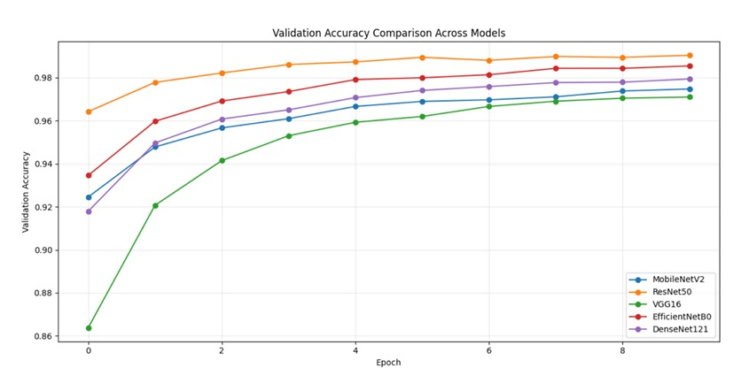

**Figure 2.** Accuracy versus wall-clock training time.

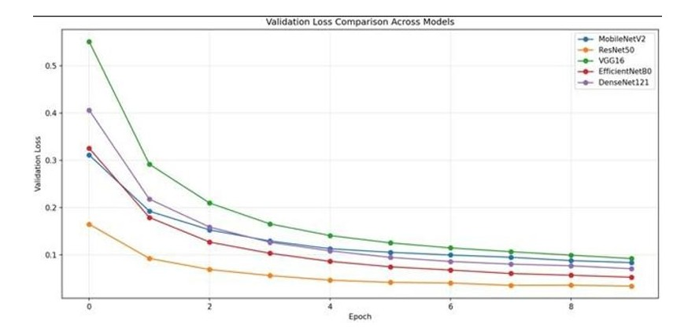

**Figure 3.** Training and validation accuracy/loss curves across epochs.

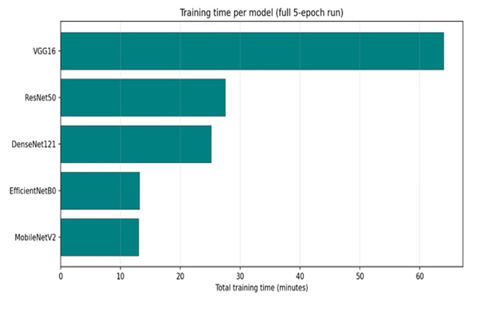

### 5.2 Confusion matrix and error analysis

**Figure 4.** Confusion matrix for ResNet50 (best single-model validator).

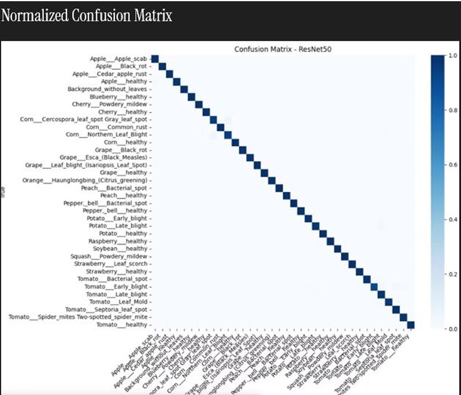

Qualitative failure modes observed from confusion matrices and Grad-CAM include:

- **Background confusion** — cluttered or non-leaf regions mapped to `Background_without_leaves` or visually similar disease classes.
- **Inter-class similarity** — confusion between related spot diseases on the same crop (e.g., tomato early blight vs late blight).
- **Domain gap** — controlled studio-style backgrounds in PlantVillage-type data differ from field capture with soil, shadow, and motion blur.

These modes motivate ensemble methods and regional field data collection (Section 8).

**Algorithm 1.** Phase 1 training and inference pipeline.

```
Input: Dataset D with C=36 classes; backbone f_θ; head g_φ; learning rate η
Output: Trained head parameters φ*; exported model weights

1. Split D into train/validation (80/20 per class, seed=123)
2. Freeze θ; initialize φ randomly
3. For epoch = 1 to 10:
4.     For each mini-batch (x, y) in train set:
5.         F ← f_θ(x)                    // forward through frozen backbone
6.         p ← softmax(g_φ(GAP(F)))      // head forward pass
7.         L ← -log(p_y)                 // sparse cross-entropy
8.         φ ← Adam(φ, ∂L/∂φ)            // backprop through head only
9. Evaluate on validation set; record accuracy, F1, MCC
10. Export best weights as .h5
11. At inference: return top-3 classes by descending p_c
```

### 5.3 Explainability: Grad-CAM

Grad-CAM (Selvaraju et al., 2017) produces a coarse localization map by combining the gradient of the target class score with the final convolutional feature maps.

Let A^k denote the k-th feature map of the target convolutional layer, and y^c be the pre-softmax score for class c. The neuron importance weight is:

> **α_k^c = (1 / h·w) × Σ_i Σ_j  (∂y^c / ∂A_{i,j}^k)**

The class-discriminative localization map is:

> **L^c = ReLU( Σ_k  α_k^c · A^k )**

ReLU suppresses negatively contributing regions. The heatmap is upsampled to input resolution and overlaid on the leaf image for visual inspection.

**Listing 3.** Grad-CAM is implemented in `gradcam_saved_weights.py`; gradients are taken with respect to pre-softmax logits to avoid saturation when softmax confidence is very high.

**Figure 5.** Grad-CAM overlay on a representative correct classification.

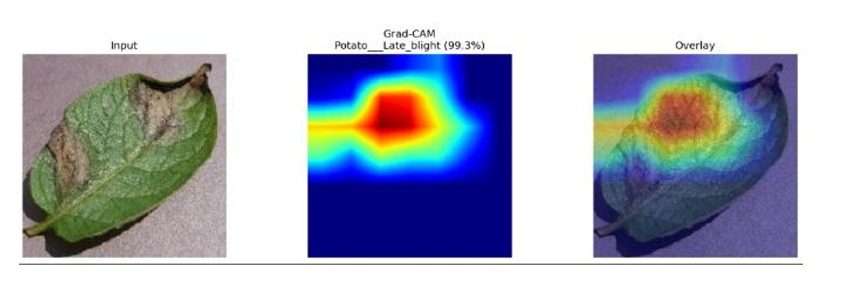

Grad-CAM confirms that models attend primarily to lesion-bearing leaf regions in successful predictions. It does not prove causal disease mechanisms and may highlight background shortcuts even when predictions are correct.

### 5.4 Deployment tradeoff: why EfficientNetB0 was selected (RQ2)

Although ResNet50 achieves the highest validation accuracy, **EfficientNetB0 was deployed in RootSage AI**. This decision constitutes a practical ablation on the accuracy–efficiency frontier:

| Criterion | ResNet50 | EfficientNetB0 | Implication |
|-----------|----------|----------------|-------------|
| Validation accuracy | 99.04% | 98.55% | Δ = 0.49 pp — small absolute gap |
| Macro F1 | 0.9886 | 0.9830 | ResNet50 better, but both strong |
| Parameters | 24.1M | 4.4M | EfficientNetB0 ≈ 5.5× smaller |
| Training time | 27.5 min | 13.2 min | EfficientNetB0 ≈ 2× faster |
| Inference memory | Higher | Lower | Better for shared college/Render server |

**Interpretation:** For a farmer-facing portal where latency, RAM, and maintainability constrain server cost, EfficientNetB0 offers the best **accuracy–efficiency tradeoff**. ResNet50 remains the preferred candidate for a future **ensemble** (Section 9) where diversity may reduce correlated errors. MobileNetV2 is the preferred edge candidate if on-device TensorFlow Lite deployment is prioritized (~97.5% accuracy, 2.6M parameters). VGG16 illustrates that **parameter count alone does not predict runtime**: VGG16 has fewer parameters than ResNet50 but trained slowest (64 min) due to higher FLOPs per layer.

---

## 6. Web system design

Phase 2 translates the classification model into **RootSage AI**, a farmer-centric system where predictions are only the first step in a longer decision-support workflow.

### 6.1 System architecture

RootSage AI follows a three-tier architecture: browser client, Python API server, and external integration services. CNN inference runs co-located with the API to avoid third-party ML latency.

```
+-----------------------------------------------------------+
|                    FRONTEND (Vercel)                      |
|  Next.js · React · Tailwind CSS · Framer Motion           |
|  Pages: Home, Library, History, Progress, Admin           |
+-----------------------------------------------------------+
                            |
                     HTTPS REST API
                            |
+-----------------------------------------------------------+
|                 BACKEND (FastAPI / Python)                |
|  Routes: /predict, /guidance, /voice, /whatsapp,        |
|          /progress, /health                               |
+-----------------------------------------------------------+
              |                           |
+-------------+             +-----------+-------------------+
| CNN Models  |             | AI Guidance Providers         |
| EfficientNet|             | Gemini -> Groq -> NVIDIA ->   |
| B0 (crop)   |             | Ollama -> Local dictionary    |
| Medicinal   |             +-------------------------------+
| model       |
+-------------+
```

**Figure 6.** RootSage AI system architecture.

### 6.2 Diagnosis pipeline

1. Farmer captures or uploads a JPG/PNG leaf image (max 8 MB).
2. Client-side **quality check** (sharpness, brightness) warns before inference.
3. FastAPI `/predict` endpoint runs EfficientNetB0 (crop, 36 classes) or medicinal model (13 classes).
4. Response includes disease label, confidence, confidence level, and top-3 predictions.
5. `/guidance` generates symptoms, prevention, treatment, and plain-language advice.
6. Results may be read aloud (`/voice`), shared via WhatsApp, or saved to local scan history.

Production inference preprocessing: RGB conversion, EXIF correction, 224×224 resize (Pillow), `efficientnet.preprocess_input`.

**Listing 4.** Production image preprocessing (`backend/inference/preprocess.py`).

```python
from io import BytesIO
import numpy as np
from PIL import Image, ImageOps
from tensorflow.keras.applications import efficientnet

def preprocess_image(image_bytes: bytes, image_size: int = 224) -> np.ndarray:
    image = Image.open(BytesIO(image_bytes))
    image = ImageOps.exif_transpose(image).convert("RGB")
    image = image.resize((image_size, image_size))
    array = np.asarray(image, dtype=np.float32)
    batch = np.expand_dims(array, axis=0)
    return efficientnet.preprocess_input(batch)
```

**Listing 5.** Inference and top-3 prediction (`backend/inference/predictor.py`).

```python
import numpy as np

def softmax_if_needed(values: np.ndarray) -> np.ndarray:
    values = values.astype(np.float64)
    if np.all(values >= 0) and np.isclose(values.sum(), 1.0, atol=1e-3):
        return values
    shifted = values - np.max(values)          # numerical stability
    exp = np.exp(shifted)
    return exp / exp.sum()

raw = model.predict(batch, verbose=0)[0]
probabilities = softmax_if_needed(raw)

top_indices = probabilities.argsort()[-3:][::-1]
top_predictions = [
    {"label": class_names[i], "confidence": float(probabilities[i])}
    for i in top_indices
]
```

The argmax index corresponds to **ĉ** = argmax_c p_c; confidence reported to the farmer is p_ĉ. Thresholds 0.4 and 0.7 trigger low- and medium-confidence warnings respectively.

### 6.3 LLM guidance with fallback chain (RQ3)

Farmer guidance is generated through a ordered fallback chain so the system remains functional when individual providers fail:

| Priority | Provider | Role |
|----------|----------|------|
| 1 | Gemini API | Primary online guidance |
| 2 | Groq (Llama 3.1) | First fallback |
| 3 | NVIDIA DeepSeek V4 Flash | Second fallback |
| 4 | Ollama (Qwen 2.5, on-server) | Offline-capable LLM |
| 5 | Local disease dictionary | Static fallback — always available |

This design addresses maintainability and robustness: the portal continues to return basic guidance even when all LLM APIs are unavailable or not configured.

### 6.4 Disease progress tracker

A dedicated module compares a new leaf scan against a prior scan from scan history and assigns one of four statuses:

| Status | Interpretation |
|--------|----------------|
| Improving | Disease label moves toward healthy (e.g., Early Blight → Healthy) |
| Stable | Same disease detected on both scans |
| Worsening | Healthy → diseased, or disease escalation |
| Inconclusive | Different crops, low confidence, or inconsistent labels |

Confidence scores reflect **model certainty**, not field severity; the tracker compares categorical labels and crop type rather than treating confidence delta as severity change.


### 6.5 Safety and ethics in the user interface

**Figure 7.** Disease progress tracker interface.

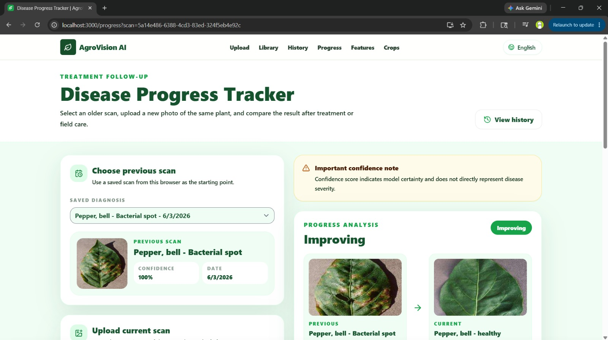

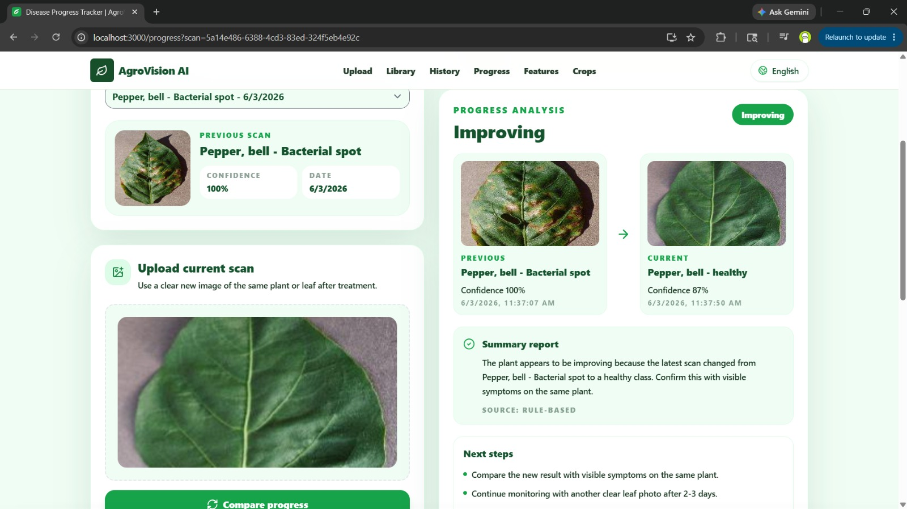

The results screen displays an explicit warning: predictions are informational; farmers must verify symptoms and consult local experts before pesticide application. Confidence is labeled as model certainty, not disease severity. Scan history is stored in browser `localStorage` only; uploaded images are processed for inference but not persisted in a user database in the current version.

---

## 7. Deployment and user features

### 7.1 Live deployment

| Component | URL / platform |
|-----------|----------------|
| Frontend | Vercel — `https://agro-vision-ai-ochre.vercel.app` |
| Backend | Render / college Linux server — `https://agrovision-ai-app.onrender.com` |
| Demo mode | Local FastAPI + ngrok tunnel |

### 7.2 Production readiness

| Requirement | Implementation |
|-------------|----------------|
| Health check | `GET /health` → `{"status":"ok"}` |
| Configuration | Environment variables for model paths, API keys, CORS (`server.env.example`) |
| Input validation | JPG/PNG only; 8 MB limit; empty upload rejection |
| CORS | Restricted to deployed frontend origins in production |
| Admin diagnostics | Token-protected `/model-info`; client-side API logs |
| Privacy | No user account database; local-only scan storage |

**Figure 8.** Home and diagnosis interface.

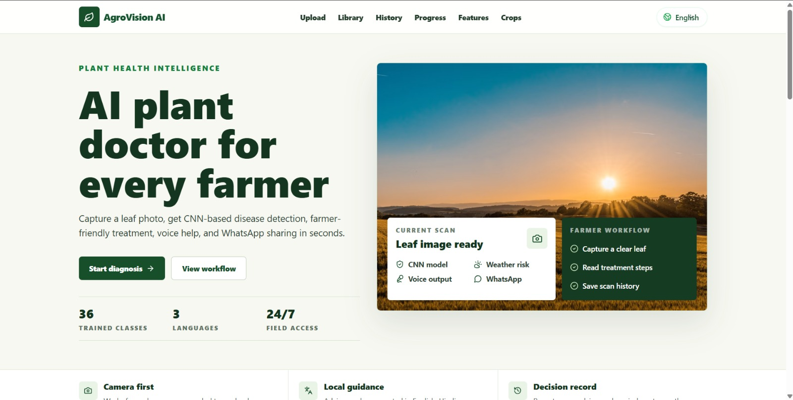

**Figure 9.** Prediction results with AI guidance and safety notice.

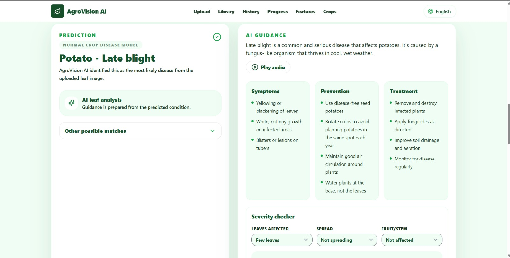

**Figure 10.** Searchable disease library (36 crop classes).

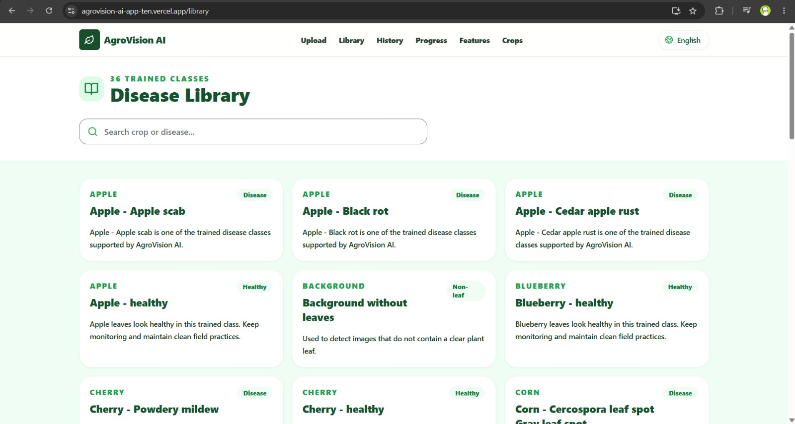

**Figure 11.** Scan history with follow-up links.

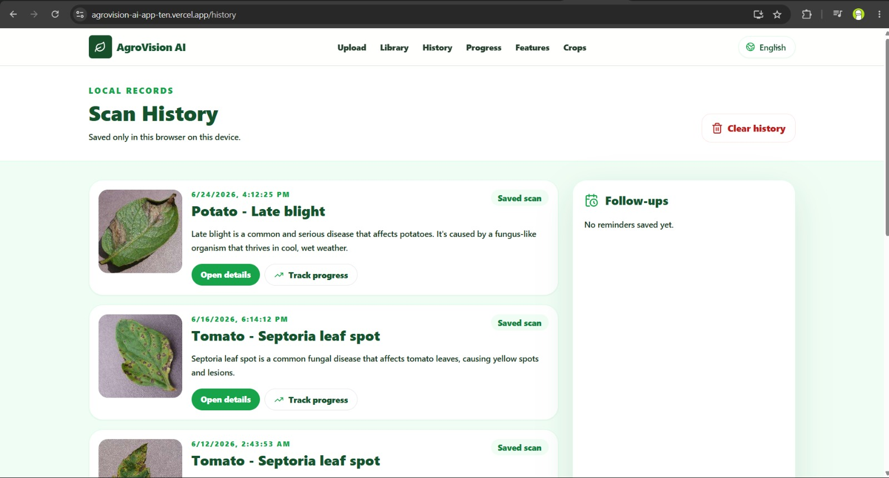

**Figure 12.** Weather-based disease spread risk panel.

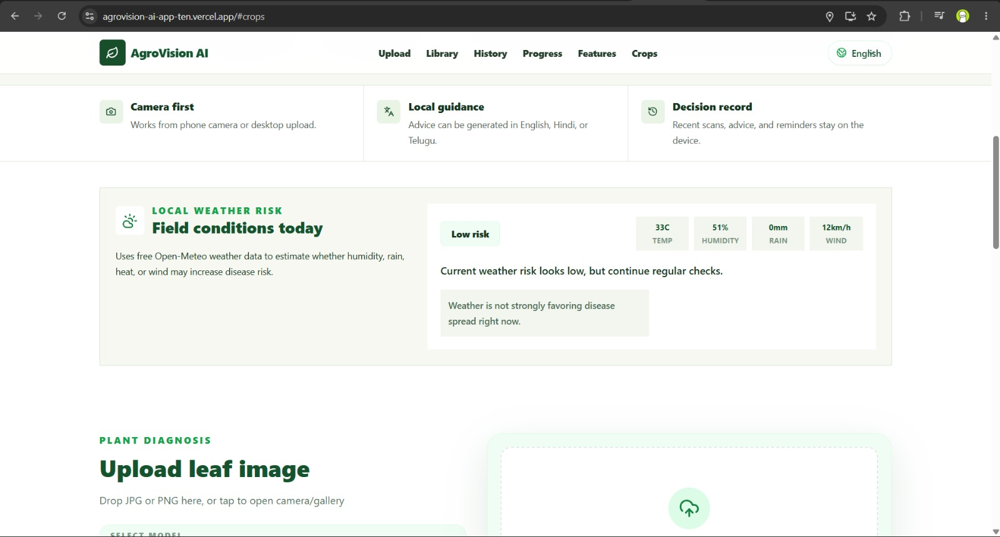

### 7.3 User-facing feature summary

| Feature | Description |
|---------|-------------|
| Multilingual UI | English, Hindi, Telugu |
| Dual model modes | Crop (36 classes) and medicinal (13 classes) |
| Top-3 predictions | With low-confidence warnings |
| AI guidance | Symptoms, prevention, treatment, farmer advice |
| Voice output | ElevenLabs / gTTS |
| WhatsApp sharing | Twilio / wa.me fallback |
| Weather risk | Open-Meteo API (humidity, rain, temperature, wind) |
| Severity questionnaire | Observation-based field severity (separate from model confidence) |
| Disease library | Reference pages for all trained classes |
| Progress tracker | Improving / stable / worsening over time |
| Follow-up reminders | Recheck tasks after treatment |

### 7.4 Practical value in low-resource settings

RootSage AI is designed for usability beyond laboratory accuracy:

- **Offline guidance fallback** via local dictionary and optional on-server Ollama when cloud LLMs fail.
- **Local scan storage** avoids mandatory accounts and supports privacy on shared family devices.
- **Mobile-first UI** with camera capture for field use.
- **Multilingual access** for non-English-speaking farmers.
- **WhatsApp sharing** leverages an already-familiar communication channel in rural India.

---

## 8. Limitations and future work

### 8.1 Research limitations

- Results are on a **validation split** only, not an independent held-out field test set.
- **Frozen backbones** may understate fine-tuned performance and alter architecture rankings.
- **Single seed / single run** — metrics may vary; multi-seed or k-fold evaluation is planned.
- PlantVillage-style **controlled backgrounds** may not represent Indian field conditions (soil, lighting, regional crops).
- Grad-CAM shows sensitivity, not causal pathology.

### 8.2 System limitations

- Classification is limited to trained classes; unknown plants may be misclassified with high apparent confidence.
- Medicinal model covers four plant types only.
- Scan history does not sync across devices without future cloud infrastructure.
- LLM guidance is informational and must not replace certified agronomist advice or local pesticide regulations.
- Rate limiting and full production SSL hardening are planned enhancements.

### 8.3 Future work

**Model research:**
- Ensemble ResNet50 + EfficientNetB0 via soft voting or stacking
- Temperature scaling / calibration (reliability diagrams, expected calibration error)
- Multi-seed evaluation with mean ± standard deviation reporting
- TensorFlow Lite quantization of EfficientNetB0 and MobileNetV2 for on-device inference

**Data and evaluation:**
- Collect regionally diverse Indian field images (rice, wheat, cotton, chilli, mango)
- Per-region accuracy reporting with agronomist-labeled difficult cases

**Field evaluation protocol (proposed):**

1. Recruit farmers or agriculture students across ≥3 agro-climatic zones.
2. Standardize capture: single leaf, natural daylight, minimal background clutter, same plant re-photographed after 3–7 days when treatment is applied.
3. Independent labeling by Krishi Vigyan Kendra (KVK) staff for disputed cases.
4. Report accuracy, macro-F1, and user task completion (time-to-diagnosis, guidance comprehension) separately from offline validation metrics.

**System roadmap:**
- Progressive Web App (PWA) offline support
- Push notifications for follow-up reminders
- Image-based severity estimation via segmentation
- Regional language expansion (Tamil, Kannada, Marathi, Bengali)
- Integration with KVK extension networks

---

## 9. Conclusion

This paper presented a two-phase study bridging rigorous CNN comparison and deployed agricultural AI.

**Phase 1** answered RQ1: under a fair frozen-backbone protocol on 36 plant disease classes, ResNet50 achieved the best validation performance (99.04% accuracy, MCC 0.9900), followed by EfficientNetB0 (98.55%). All five architectures exceeded 97% accuracy, confirming that transfer learning is effective for this dataset.

**Phase 2** answered RQ2 and RQ3: EfficientNetB0 was selected for production based on near-top accuracy with substantially lower parameter count and training time—a deliberate accuracy–efficiency tradeoff suitable for server deployment. RootSage AI embeds this model in a full-stack platform that converts predictions into multilingual, voice-enabled, WhatsApp-shareable guidance with LLM and static fallbacks, weather context, scan history, and temporal disease progress tracking.

The central lesson is that **deployed agricultural ML must be evaluated on more than offline accuracy**. A system that achieves 99% on a validation split but fails when APIs are down, cannot communicate in local languages, or provides guidance without safety context offers limited field value. RootSage AI demonstrates a path from controlled model comparison to a maintainable farmer-facing system, with a explicit plan for field validation on Indian farm imagery.

Future work will ensemble ResNet50 and EfficientNetB0, calibrate probability outputs, and execute the proposed field protocol before wider rollout.

---

## References

1. Hughes, D. P., & Salathé, M. (2015). An open access repository of images on plant health to enable the development of mobile disease diagnostics. *arXiv:1511.08060*.

2. Mohanty, S. P., Hughes, D. P., & Salathé, M. (2016). Using deep learning for image-based plant disease detection. *Frontiers in Plant Science*, 7, 1419. https://doi.org/10.3389/fpls.2016.01419

3. Sladojevic, S., Arsenovic, M., Anderla, A., Culibrk, D., & Stefanovic, D. (2016). Deep neural networks based recognition of plant diseases by leaf image classification. *Computational Intelligence and Neuroscience*, 2016, 3289801.

4. Ferentinos, K. P. (2018). Deep learning models for plant disease detection and diagnosis. *Computers and Electronics in Agriculture*, 145, 311–318.

5. Too, E. C., Li, Y. J., Njuki, S., & Liu, Y. C. (2019). A comparative study of fine-tuning deep learning models for plant disease identification. *Computers and Electronics in Agriculture*, 161, 272–279.

6. Selvaraju, R. R., Cogswell, M., Das, A., Vedantam, R., Parikh, D., & Batra, D. (2017). Grad-CAM: Visual explanations from deep networks via gradient-based localization. *Proceedings of the IEEE International Conference on Computer Vision (ICCV)*.

7. Simonyan, K., & Zisserman, A. (2015). Very deep convolutional networks for large-scale image recognition. *International Conference on Learning Representations (ICLR)*.

8. He, K., Zhang, X., Ren, S., & Sun, J. (2016). Deep residual learning for image recognition. *Proceedings of the IEEE Conference on Computer Vision and Pattern Recognition (CVPR)*.

9. Huang, G., Liu, Z., Van Der Maaten, L., & Weinberger, K. Q. (2017). Densely connected convolutional networks. *Proceedings of the IEEE Conference on Computer Vision and Pattern Recognition (CVPR)*.

10. Sandler, M., Howard, A., Zhu, M., Zhmoginov, A., & Chen, L. C. (2018). MobileNetV2: Inverted residuals and linear bottlenecks. *Proceedings of the IEEE Conference on Computer Vision and Pattern Recognition (CVPR)*.

11. Tan, M., & Le, Q. (2019). EfficientNet: Rethinking model scaling for convolutional neural networks. *Proceedings of the International Conference on Machine Learning (ICML)*.

12. Kingma, D. P., & Ba, J. (2015). Adam: A method for stochastic optimization. *International Conference on Learning Representations (ICLR)*.

---

## Appendix A — Reproducibility checklist

| Item | Setting |
|------|---------|
| Notebook | `Comparative_Study_CNN_refactored.ipynb` |
| Classes | 36 |
| Image size | 224 × 224 |
| Batch size | 24 |
| Epochs | 10 |
| Learning rate | 1 × 10⁻⁴ |
| Optimizer | Adam |
| Loss | Sparse categorical cross-entropy |
| Train/val split | 80/20, seed 123, per-class |
| Models | MobileNetV2, ResNet50, VGG16, EfficientNetB0, DenseNet121 |
| Metrics | scikit-learn |
| TensorFlow (inference) | 2.17.1 |

## Appendix B — Supported class labels

**Crop model (36):** Apple (4), Blueberry (1), Cherry (2), Corn (4), Grape (4), Orange (1), Peach (2), Pepper (2), Potato (3), Raspberry (1), Soybean (1), Squash (1), Strawberry (2), Tomato (8), Background (1).

**Medicinal model (13):** Camphor (3), HariTaki (3), Neem (4), Sojina (3).

## Appendix C — API verification commands

```bash
curl https://agrovision-ai-app.onrender.com/health

curl -X POST "https://agrovision-ai-app.onrender.com/predict" \
  -F "file=@leaf.jpg" \
  -F "mode=crop"

curl -X POST "https://agrovision-ai-app.onrender.com/guidance" \
  -H "Content-Type: application/json" \
  -d "{\"disease\":\"Tomato___Early_blight\",\"language\":\"en\"}"
```

## Appendix D — Train/validation split code

```python
import tensorflow as tf

SEED = 123
BATCH_SIZE = 24
IMAGE_SIZE = (224, 224)
DATASET_DIR = "path/to/Plant_leave_diseases_dataset_with_augmentation"

train_ds = tf.keras.utils.image_dataset_from_directory(
    DATASET_DIR, validation_split=0.2, subset="training",
    seed=SEED, image_size=IMAGE_SIZE, batch_size=BATCH_SIZE,
)

val_ds = tf.keras.utils.image_dataset_from_directory(
    DATASET_DIR, validation_split=0.2, subset="validation",
    seed=SEED, image_size=IMAGE_SIZE, batch_size=BATCH_SIZE,
)
```

## Appendix E — Extended training with ECA and fine-tuning (deployment notebooks)

Production crop and medicinal models in RootSage AI were further refined using `RootSage_Combined_Plant_Disease_Training.ipynb` and `RootSage_Medicinal_Plant_Training.ipynb`. These notebooks extend Phase 1 with **Efficient Channel Attention (ECA)** and optional backbone fine-tuning:

**Listing 7.** ECA block and extended model head (abbreviated from training notebook).

```python
def eca_block(inputs, gamma=2, b=1, name="eca"):
    channels = inputs.shape[-1]
    kernel_size = max(3, int(abs((np.log2(float(channels)) + b) / gamma)))
    if kernel_size % 2 == 0:
        kernel_size += 1
    x = layers.GlobalAveragePooling2D()(inputs)
    x = layers.Reshape((-1, 1))(x)
    x = layers.Conv1D(1, kernel_size=kernel_size, padding="same", use_bias=False)(x)
    x = layers.Activation("sigmoid")(x)
    x = layers.Reshape((1, 1, channels))(x)
    return layers.Multiply()([inputs, x])

base_model = keras.applications.EfficientNetV2B0(
    include_top=False, weights="imagenet",
    input_shape=(224, 224, 3), include_preprocessing=True,
)
base_model.trainable = False

inputs = keras.Input(shape=(224, 224, 3))
x = base_model(inputs, training=False)
x = eca_block(x, name="disease_eca")
x = layers.GlobalAveragePooling2D()(x)
x = layers.BatchNormalization()(x)
x = layers.Dropout(0.35)(x)
outputs = layers.Dense(num_classes, activation="softmax")(x)
model = keras.Model(inputs, outputs)
```

Fine-tuning unfreezes the last 45 backbone layers with a reduced learning rate (2×10⁻⁵) after initial head training. This extended pipeline is separate from the five-model frozen-backbone comparison but powers the deployed RootSage AI inference service.
